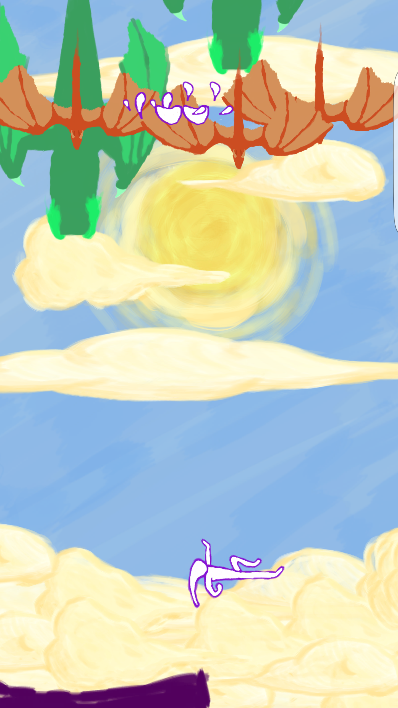
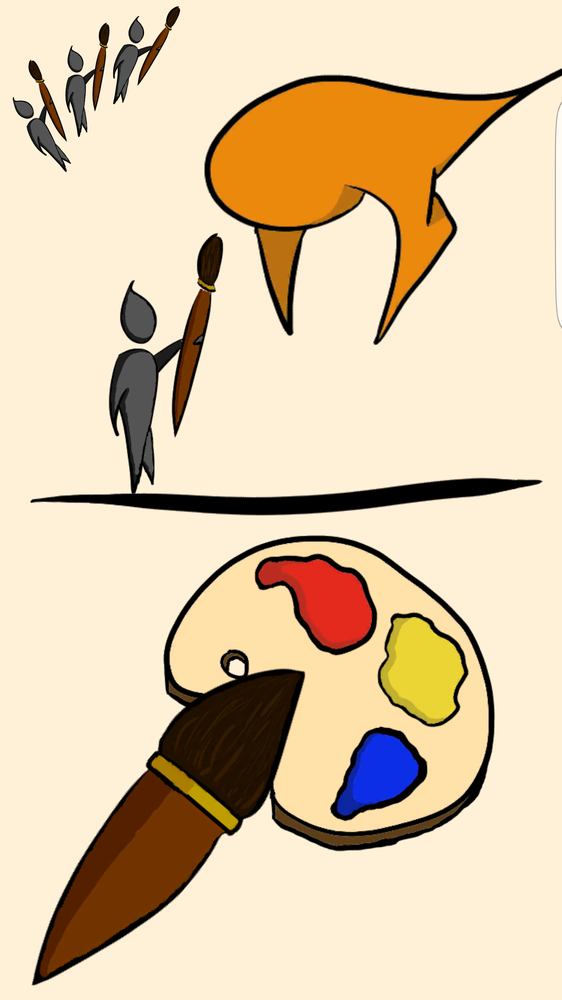
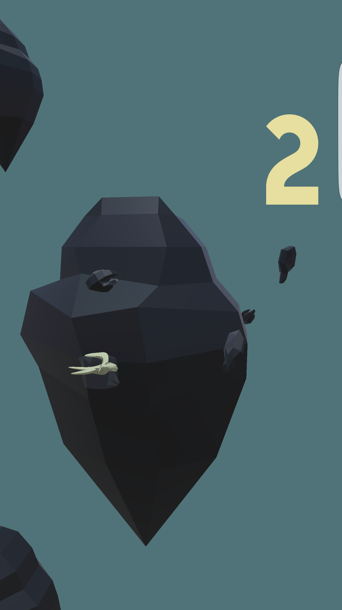

  
  
  
  

Unity is a game-engine and API used to develop 2D and 3D games for multiple platforms. My interest in Unity started around the same time
I began to teach myself coding, as I had used other engines before and wanted to start making apps for my phone. From the summer of 2015
to around the middle of 2017, I developed several games to enter in game jams and competitions. I uploaded only 1 to gamejolt, as the rest 
were for the Android platform. They are pictured below, and the link to my first one, on gamejolt, is also linked below. If I could go
back and rewrite/design them with the knowledge I have now, I would make changes to the functionality and art, but as long as I'm in 311
and 314, I don't know if I'll have time!

The games are mostly simple, but I tried to focus on different elements when making them. One of the games is 3D, for which I created and
scripted the models, using Unity C# and the Unity API. Due to account restrictions, the games are not on the Google Play App Store, but if
I can redesign them I will most likely put them there soon. The tools used to create the games were the Unity Engine, Monodevelop, and
Visual Studio for building, scripting, and compiling, and Blender, Corel Painter, and Audacity for asset creation. These projects taught me
alot about design, code style, and the various toolsets I used to complete them.

Swirly: <a href="https://https://gamejolt.com/games/swirly/223164">(Very basic, my first game!)</a>
