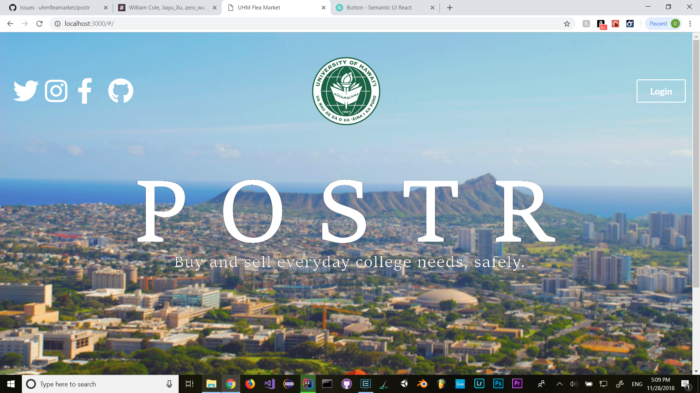
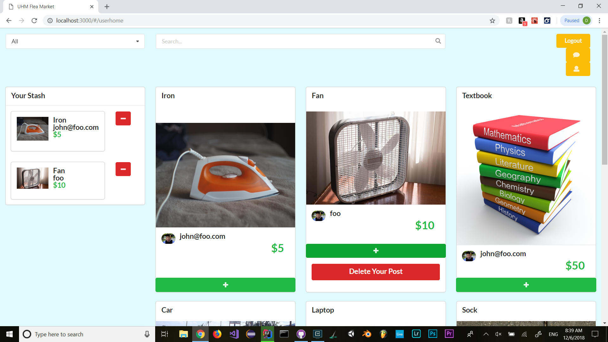

Postr is the application that I developed with my team of fellow students in ICS 314, as our final project. It is a website whose intention
is to replace sites like Craigslist and eBay for college students and campuses, and create a safer space where only students are able to
buy and sell used items from each other. For the project, I mostly worked on the UI of the website, although I did do a fair amount of 
backend development in React, Meteor, and MongoDB.

While I did learn a lot about the technical aspect of creating a web application, I believe the most important lessons I learned were in
the importance of communication. We were instructed to use Github for source control, and to meet weekly. We were unable to meet weekly, opting to communicate strictly via text on Slack, and although we did use Github, some of the practices of good software development, 
(specifically branching our issues off of the correct master branch for smoother merging) were not consistently used. These choices
led to inconsistent communication, confusion on tasks, and nightmarish merging bugs that we were ultimately unable to fix in time for our presentation. The project was a first-hand experience in what I feel are absolutely essential technical and organizational skills needed
for successful collaborative enterprise development.

Below is a screenshot of the page I implemented:

<a href="https://github.com/uhmfleamarket/postr-src">Postr Source Code</a>
<a href="https://github.com/uhmfleamarket/postr/blob/master/index.md">Postr Team Page</a>
